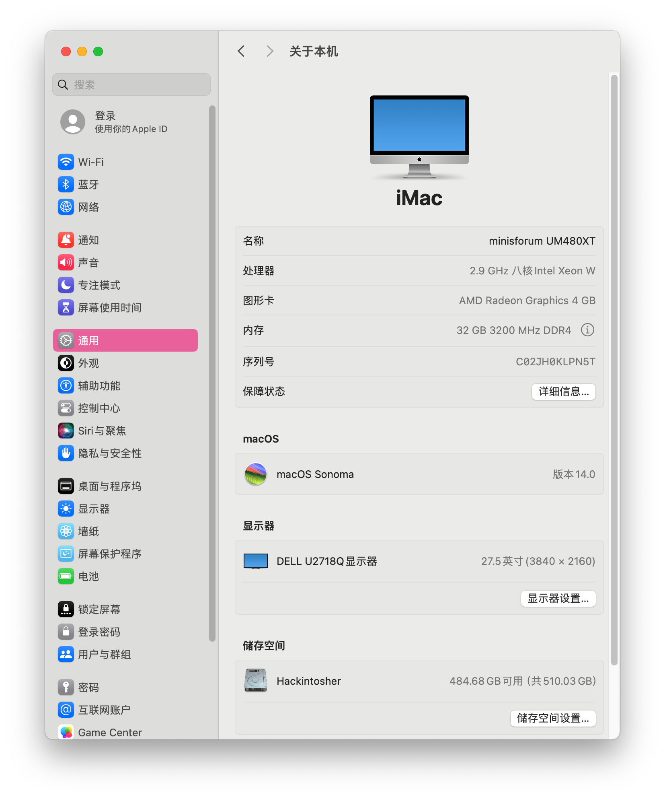
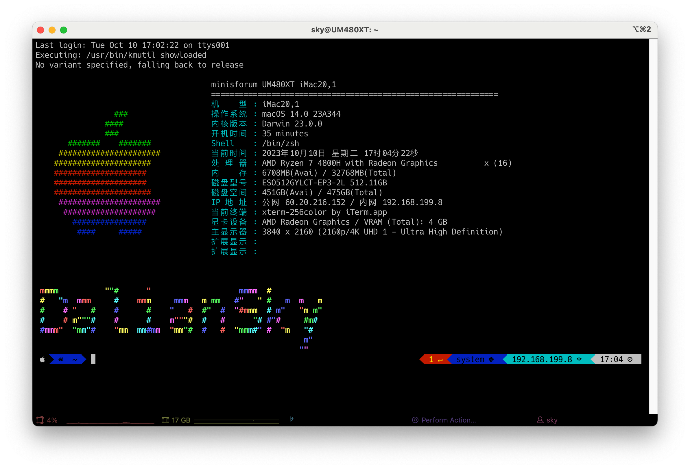

# minisforum-UM480XT-Hackintosh

## 电脑配置

|   规格    |                           详细信息                           |
| :-------: | :----------------------------------------------------------: |
| 电脑型号  |                      minisforum UM480XT                      |
| 操作系统  | macOS `Sonoma` / `Ventura` /  `Monterey` / `Big Sur` / `Catalina` |
|  处理器   |                 AMD 锐龙 R5-4800H 8核16线程                  |
|   内存    |                      16 GB DDR4 3200MHz                      |
|   硬盘1   |                KINGSTON OM8PDP3512B-A01 512GB                |
|   硬盘2   |                    可接SATA 2.5寸硬盘/SSD                    |
|   核显    |      Radeon Vega Graphics 显存建议设置为：3GB/4GB       |
|  显示器   |                              无                              |
|   声卡    |                       USB Audio Device                       |
| 无线网卡  | m.2 NGFF插槽，默认出厂为 `Mediatek RZ608` 已更换为[BCM94360Z3](https://blog.daliansky.net/uploads/WeChatandShop.png) |
| 有线网卡1 |               Intel Ethernet Controller I225-V               |

# 更新记录

- 11-3-2023

  - 第一次提交
  - 修复声卡驱动，支持麦克风输入
  
  

